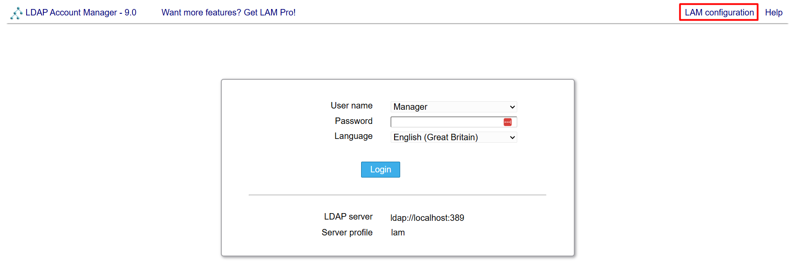
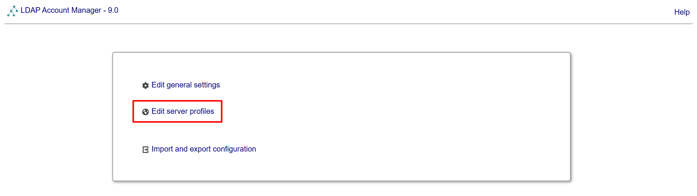
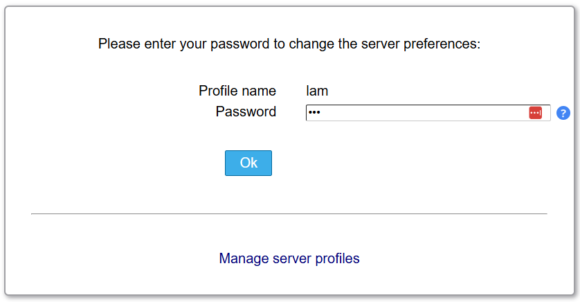
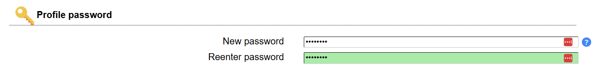
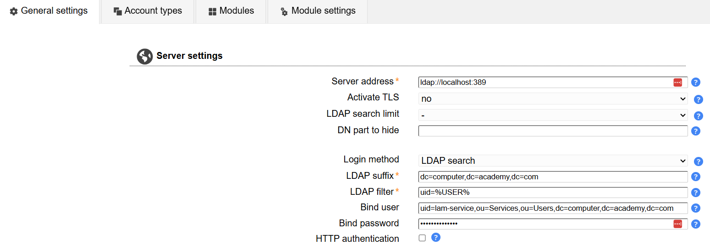
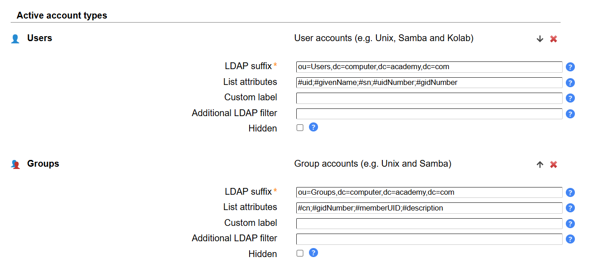
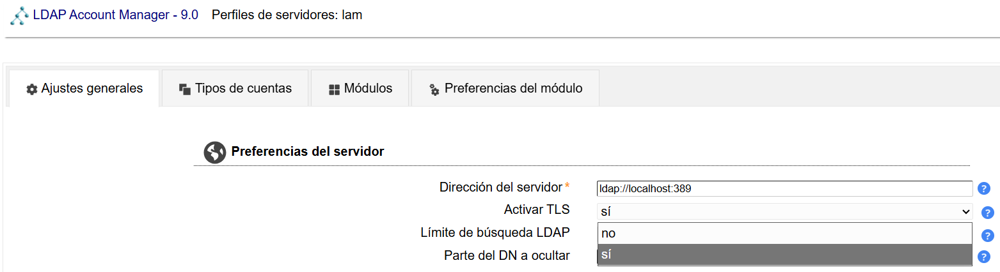

# Secure OpenLDAP Server on Debian13

<p align="center">
  
</p>

## :book: Index

* 👮 [Terms of use](./LICENSE)
* ♻️ [Features](#recycle-features)
* ✅ [Requirements](#white_check_mark-requirements)
* 📚 [Resources](#books-resources)
* ⚙️ [Install basic software](#gear-install-basic-software)

## :recycle: Features
ORDER:

* 1. Create the directory tree structure
* 2. Load the sudo schema
* 3. Create the users
* 4. Create the groups
* 5. Create the sudo roles
* 6. Apply the LAM ACL

## 0 Prepare LDAP Servers
Edit the hosts file or configure LDAP records on our DNS servers
```bash
sudo nano /etc/hosts
```
```conf
127.0.0.1       localhost
# 127.0.1.1     Ldap1.computer.academy.com      Ldap1
192.168.1.32    Ldap1.computer.academy.com      Ldap1

# The following lines are desirable for IPv6 capable hosts
::1     localhost ip6-localhost ip6-loopback
ff02::1 ip6-allnodes
ff02::2 ip6-allrouters
```

## 1 install software
```bash
apt update
apt install slapd ldap-utils sudo
```

### 1.1 Create admin password 

## 2 Initialize LDAP wizard
```
sudo dpkg-reconfigure slapd
```
### 2.1 Select NO omit LDAP config

### 2.2 Check the Domain name

### 2.3 Check the organization  name

### 2.4 Enter and repeat the admin password 

### 2.5 No delete old database 

### 2.6 Yes move old database

### 2.7  Restart and check service slapd
```bash
sudo systemctl restart slapd
sudo systemctl status slapd
```
###  2.8 Verify Domain name its correct
sudo  slapcat

## 3 Create structure of LDAP dc=computer,dc=academy,dc=com (Example)

```conf
dc=computer,dc=academy,dc=com
├── ou=Users
│   ├── ou=Active
│   ├── ou=Inactive
│   └── ou=Services
│
├── ou=Groups
│   ├── ou=System
│   ├── ou=Applications
│   └── ou=NetworkGroups
│
├── ou=Machines
│   ├── ou=Servers
│   ├── ou=Clients
│   └── ou=Disabled
│
├── ou=Roles
│   ├── ou=Sudoers
│   ├── ou=LDAP
│   └── ou=Printing
│
├── ou=Policies
│
├── ou=Certificates
│   ├── ou=CertificateAuthorities
│   ├── ou=Personal
│   ├── ou=Machines
│   ├── ou=Services
│   └── ou=Revoked
│
└── ou=Resources
    ├── ou=Shared
    ├── ou=Printers
    ├── ou=Applications
    └── ou=Rooms
```

### 3.1 Create a new structure file base.ldif
```bash
nano base.ldif
```

```conf
# base.ldif

dn: dc=computer,dc=academy,dc=com
objectClass: top
objectClass: dcObject
objectClass: organization
dc: computer
o: Computer Academy

dn: ou=Users,dc=computer,dc=academy,dc=com
objectClass: top
objectClass: organizationalUnit
ou: Users

dn: ou=Active,ou=Users,dc=computer,dc=academy,dc=com
objectClass: top
objectClass: organizationalUnit
ou: Active

dn: ou=Inactive,ou=Users,dc=computer,dc=academy,dc=com
objectClass: top
objectClass: organizationalUnit
ou: Inactive

dn: ou=Services,ou=Users,dc=computer,dc=academy,dc=com
objectClass: top
objectClass: organizationalUnit
ou: Services

dn: ou=Groups,dc=computer,dc=academy,dc=com
objectClass: top
objectClass: organizationalUnit
ou: Groups

dn: ou=System,ou=Groups,dc=computer,dc=academy,dc=com
objectClass: top
objectClass: organizationalUnit
ou: System

dn: ou=Applications,ou=Groups,dc=computer,dc=academy,dc=com
objectClass: top
objectClass: organizationalUnit
ou: Applications

dn: ou=NetworkGroups,ou=Groups,dc=computer,dc=academy,dc=com
objectClass: top
objectClass: organizationalUnit
ou: NetworkGroups

dn: ou=Machines,dc=computer,dc=academy,dc=com
objectClass: top
objectClass: organizationalUnit
ou: Machines

dn: ou=Servers,ou=Machines,dc=computer,dc=academy,dc=com
objectClass: top
objectClass: organizationalUnit
ou: Servers

dn: ou=Clients,ou=Machines,dc=computer,dc=academy,dc=com
objectClass: top
objectClass: organizationalUnit
ou: Clients

dn: ou=Disabled,ou=Machines,dc=computer,dc=academy,dc=com
objectClass: top
objectClass: organizationalUnit
ou: Disabled

dn: ou=Roles,dc=computer,dc=academy,dc=com
objectClass: top
objectClass: organizationalUnit
ou: Roles

dn: ou=Sudoers,ou=Roles,dc=computer,dc=academy,dc=com
objectClass: top
objectClass: organizationalUnit
ou: Sudoers

dn: ou=LDAP,ou=Roles,dc=computer,dc=academy,dc=com
objectClass: top
objectClass: organizationalUnit
ou: LDAP

dn: ou=Printing,ou=Roles,dc=computer,dc=academy,dc=com
objectClass: top
objectClass: organizationalUnit
ou: Printing

dn: ou=Policies,dc=computer,dc=academy,dc=com
objectClass: top
objectClass: organizationalUnit
ou: Policies

dn: ou=Certificates,dc=computer,dc=academy,dc=com
objectClass: top
objectClass: organizationalUnit
ou: Certificates

dn: ou=CertificateAuthorities,ou=Certificates,dc=computer,dc=academy,dc=com
objectClass: top
objectClass: organizationalUnit
ou: CertificateAuthorities

dn: ou=Personal,ou=Certificates,dc=computer,dc=academy,dc=com
objectClass: top
objectClass: organizationalUnit
ou: Personal

dn: ou=Machines,ou=Certificates,dc=computer,dc=academy,dc=com
objectClass: top
objectClass: organizationalUnit
ou: Machines

dn: ou=Services,ou=Certificates,dc=computer,dc=academy,dc=com
objectClass: top
objectClass: organizationalUnit
ou: Services

dn: ou=Revoked,ou=Certificates,dc=computer,dc=academy,dc=com
objectClass: top
objectClass: organizationalUnit
ou: Revoked

dn: ou=Resources,dc=computer,dc=academy,dc=com
objectClass: top
objectClass: organizationalUnit
ou: Resources

dn: ou=Shared,ou=Resources,dc=computer,dc=academy,dc=com
objectClass: top
objectClass: organizationalUnit
ou: Shared

dn: ou=Printers,ou=Resources,dc=computer,dc=academy,dc=com
objectClass: top
objectClass: organizationalUnit
ou: Printers

dn: ou=Applications,ou=Resources,dc=computer,dc=academy,dc=com
objectClass: top
objectClass: organizationalUnit
ou: Applications

dn: ou=Rooms,ou=Resources,dc=computer,dc=academy,dc=com
objectClass: top
objectClass: organizationalUnit
ou: Rooms
```

### 3.2 Import structure to lDAP 
```bash
sudo ldapadd -x -D "cn=admin,dc=computer,dc=academy,dc=com" -W -f base.ldif
```
⚠️ If import fails because to the first DN block erase this.

Check the base group is imported
```bash
sudo ldapsearch -x -b "dc=computer,dc=academy,dc=com" ou
```

## 4 Schemas to LDAP
El esquema sudo debe existir antes de importar cualquier LDIF que contenga objetos sudoRole, pero no depende de que hayas importado previamente base.ldif.

### 4.1 Download the Debian packet

```bash
mkdir sudo-schema
cd sudo-schema
apt download sudo-ldap
```

### 4.2 Extract the Debian packet
```bash
dpkg-deb -x sudo-ldap_*.deb extract
```

### 4.3 Import sudoers schema
```bash
sudo ldapadd -Y EXTERNAL -H ldapi:/// -f extract/usr/share/doc/sudo-ldap/schema.olcSudo
```
:warning: if you dont find the schema in the extract you can search:

```bash
find extract -name "schema.olcSudo"
```
## Modules
### Add MemberOf Module
```bash
nano Memberof.ldif
```
```bash
#Memberof.ldif

dn: cn=module{0},cn=config
changetype: modify
add: olcModuleLoad
olcModuleLoad: memberof
```
```bash
sudo ldapmodify -Y EXTERNAL -H ldapi:/// -f Memberof.ldif
```

### Add Overlay MemberOf
```bash
nano OverlayMemberOf.ldif
```
```conf
# OverlayMemberOf.ldif

dn: olcOverlay=memberof,olcDatabase={1}mdb,cn=config
objectClass: olcConfig
objectClass: olcMemberOf
objectClass: olcOverlayConfig
objectClass: top
olcOverlay: memberof
olcMemberOfRefInt: TRUE
```
```bash
sudo ldapadd -Y EXTERNAL -H ldapi:/// -f OverlayMemberOf.ldif
```

### Add Refint Module
```bash
nano Refint.ldif
```
```conf
# Refint.ldif

dn: cn=module{0},cn=config
changetype: modify
add: olcModuleLoad
olcModuleLoad: refint
```
```bash
sudo ldapmodify -Y EXTERNAL -H ldapi:/// -f Refint.ldif
```

### Add Overlay Refint
```bash
nano OverlayRefint.ldif
```
```conf
# OverlayRefint.ldif

dn: olcOverlay=refint,olcDatabase={1}mdb,cn=config
objectClass: olcConfig
objectClass: olcOverlayConfig
objectClass: olcRefintConfig
olcOverlay: refint
olcRefintAttribute: member memberOf
```
```bash
sudo ldapadd -Y EXTERNAL -H ldapi:/// -f OverlayRefint.ldif
```

### Add MultiProvider module
If we configure multiple multi-master instances without this module enabled, we will not have write permissions on them, as they will only accept changes from their provider
```bash
nano MultiProvider.ldif
```
```conf
# MultiProvider.ldif

dn: olcDatabase={1}mdb,cn=config
changetype: modify
add: olcMultiProvider
olcMultiProvider: TRUE
```
```bash
sudo ldapmodify -Y EXTERNAL -H ldapi:/// -f MultiProvider.ldif
```

## 5 Create Users

### 5.1 Create Users.ldif
```bash
nano Users.ldif 
```
```conf
# Users.ldif

dn: uid=LDAP-Writer,ou=Services,ou=Users,dc=computer,dc=academy,dc=com
objectClass: top
objectClass: person
objectClass: organizationalPerson
objectClass: inetOrgPerson
uid: LDAP-Writer
cn: LDAP-Writer
sn: LDAP-Writer
userPassword: {SSHA}K9sL4Ny7jVwq8Bt2cWmYF7RzP1XeHkQa
description: Service account for writing to the LDAP tree

dn: uid=LDAP-Reader,ou=Services,ou=Users,dc=computer,dc=academy,dc=com
objectClass: top
objectClass: person
objectClass: organizationalPerson
objectClass: inetOrgPerson
uid: LDAP-Reader
cn: LDAP-Reader
sn: LDAP-Reader
userPassword: {SSHA}XyZ12345abcdef67890GhIjKlMnOpQrS
description: Service account for reading to the LDAP tree

dn: uid=user1,ou=Active,ou=Users,dc=computer,dc=academy,dc=com
objectClass: top
objectClass: person
objectClass: organizationalPerson
objectClass: inetOrgPerson
objectClass: posixAccount
objectClass: shadowAccount
uid: user1
cn: John Smith
sn: Smith
givenName: John
uidNumber: 10001
gidNumber: 20001
homeDirectory: /home/john
loginShell: /bin/bash
userPassword: {SSHA}N4mY8uLpQ2vKj7XtBwR5cHd9ZaEsTgF1
shadowLastChange: 0

dn: uid=user2,ou=Active,ou=Users,dc=computer,dc=academy,dc=com
objectClass: top
objectClass: person
objectClass: organizationalPerson
objectClass: inetOrgPerson
objectClass: posixAccount
objectClass: shadowAccount
uid: user2
cn: Alice Smith
sn: Smith
givenName: Alice
uidNumber: 10002
gidNumber: 20001
homeDirectory: /home/asmith
loginShell: /bin/bash
userPassword: {SSHA}T8pVn3LqH5yKc9RxMwEaZ7BdFuGsJ2Nt
shadowLastChange: 0

dn: uid=zabbix-service,ou=Services,ou=Users,dc=computer,dc=academy,dc=com
objectClass: top
objectClass: person
objectClass: organizationalPerson
objectClass: inetOrgPerson
cn: Zabbix Service Account
sn: Service
uid: zabbix-service
userPassword: {SSHA}R7xTc2PnLmQ4VbY9KwEjF5ZdNsAuHcG3
description: Service account for monitoring LDAP
```

### 5.2 Import Users 
```bash
ldapadd -x -D "cn=admin,dc=computer,dc=academy,dc=com" -W -f Users.ldif
```

## 6 Create Groups

### 6.1 Create Groups.ldif
```bash
nano Groups.ldif 
```
```conf
# Groups.ldif

dn: cn=LDAP-Writers,ou=Applications,ou=Groups,dc=computer,dc=academy,dc=com
objectClass: top
objectClass: groupOfNames
cn: LDAP-Writers
member: uid=LDAP-Writer,ou=Services,ou=Users,dc=computer,dc=academy,dc=com
member: uid=user1,ou=Active,ou=Users,dc=computer,dc=academy,dc=com
description: Group for user accounts that write LDAP

dn: cn=LDAP-Readers,ou=Applications,ou=Groups,dc=computer,dc=academy,dc=com
objectClass: top
objectClass: groupOfNames
cn: LDAP-Readers
member: uid=LDAP-Reader,ou=Services,ou=Users,dc=computer,dc=academy,dc=com
member: uid=zabbix-service,ou=Services,ou=Users,dc=computer,dc=academy,dc=com
description: Group for user accounts that read LDAP

dn: cn=Linux-Administrators,ou=System,ou=Groups,dc=computer,dc=academy,dc=com
objectClass: top
objectClass: posixGroup
cn: Linux-Administrators
gidNumber: 20001
description: Group for user accounts that administer Linux systems using sudo comand

dn: cn=SSH-Access,ou=System,ou=Groups,dc=computer,dc=academy,dc=com
objectClass: top
objectClass: groupOfNames
cn: SSH-Access
member: uid=user1,ou=Active,ou=Users,dc=computer,dc=academy,dc=com
description: Group used to restrict remote SSH access to authorized users

dn: cn=Wiki-Access,ou=Applications,ou=Groups,dc=computer,dc=academy,dc=com
objectClass: top
objectClass: groupOfNames
cn: Wiki-Access
member: uid=user1,ou=Active,ou=Users,dc=computer,dc=academy,dc=com
description: Authorized users for MediaWiki access
```

### 6.2 Import Groups
```bash
ldapadd -x -D "cn=admin,dc=computer,dc=academy,dc=com" -W -f Groups.ldif
```

## 7 Create Roles

### 7.1 Create Roles.ldif
```bash
nano Roles.ldif 
```

```conf
# Roles.ldif

dn: cn=Role-Linux-Admin,ou=Sudoers,ou=Roles,dc=computer,dc=academy,dc=com
objectClass: top
objectClass: sudoRole
cn: Role-Linux-Admin
sudoUser: %Linux-Administrators
sudoHost: ALL
sudoCommand: ALL

dn: cn=Role-LDAP-Admin,ou=LDAP,ou=Roles,dc=computer,dc=academy,dc=com
objectClass: top
objectClass: sudoRole
cn: Role-LDAP-Admin
sudoUser: cn=LDAP-Administrators,ou=Applications,ou=Groups,dc=computer,dc=academy,dc=com
sudoHost: ALL
sudoCommand: /usr/bin/ldap*
sudoCommand: /usr/sbin/slap*
sudoCommand: /bin/systemctl *slapd*
sudoCommand: /usr/bin/journalctl *slapd*
sudoCommand: /usr/bin/sudoedit /etc/ldap/*
sudoCommand: /usr/bin/sudoedit /etc/default/slapd/*
sudoCommand: /usr/bin/sudoedit /etc/systemd/system/slapd*
```

### 7.2 Import Roles
```bash
ldapadd -x -D "cn=admin,dc=computer,dc=academy,dc=com" -W -f Roles.ldif
```

## 8 Create ACL lists

### 8.1 Create ACLs to assign permissions and protect the LDAP tree from anonymous queries.
```bash
nano ACL.ldif 
```

```conf
# ACL.ldif

dn: olcDatabase={1}mdb,cn=config
changetype: modify
delete: olcAccess
olcAccess: {2}to * by * read
-
add: olcAccess
olcAccess: {2}to dn.subtree="dc=computer,dc=academy,dc=com"
  by group.exact="cn=LDAP-Writers,ou=Applications,ou=Groups,dc=computer,dc=academy,dc=com" write
  by group.exact="cn=LDAP-Readers,ou=Applications,ou=Groups,dc=computer,dc=academy,dc=com" read
  by * none
```

### 8.2 Import ACL 
```bash
sudo ldapmodify -Y EXTERNAL -H ldapi:/// -f ACL.ldif
```

### 9.0 Advanced Indexing

```conf
# Index.ldif

dn: olcDatabase={1}mdb,cn=config
changetype: modify
add: olcDbIndex
olcDbIndex: entryCSN eq
olcDbIndex: entryUUID eq
olcDbIndex: sn eq,sub
olcDbIndex: mail eq
olcDbIndex: loginShell eq
olcDbIndex: sudoUser eq
olcDbIndex: sudoHost eq
```
Apply:
```bash
sudo ldapmodify -Y EXTERNAL -H ldapi:/// -f Index.ldif
```

Check:
```bash
sudo ldapsearch -LLL -Y EXTERNAL -H ldapi:/// -b "olcDatabase={1}mdb,cn=config" olcDbIndex
```
Stop the service:
```bash
sudo systemctl stop slapd
```
Regenerate index:
```bash
sudo slapindex -n 1
```
Change owner files:
```bash
sudo chown -R openldap:openldap /var/lib/ldap/
```

Check owner files:
```bash
sudo ls -la /var/lib/ldap/
```

Start the service:
```bash
sudo systemctl start slapd
```

# Multimaster
```conf
 LDAP01 completo
↓
Exportar
↓
Crear LDAP02
↓
Verificar que LDAP02 funciona
↓
Configurar replicación
↓
Comprobar que replica
↓
Instalar LAM
```

## 9 Activate SincProv on LDAP-1 and LDAP-2:

### 9.1 create SincProv.ldif:
```bash
nano syncprov.ldif
```

```bash
dn: cn=module{0},cn=config
changetype: modify
add: olcModuleLoad
olcModuleLoad: syncprov.la

dn: olcOverlay=syncprov,olcDatabase={1}mdb,cn=config
objectClass: olcOverlayConfig
objectClass: olcSyncProvConfig
olcOverlay: syncprov
olcSpCheckpoint: 100 10
olcSpSessionLog: 100
```

### 9.2 Import SincProv
```bash
sudo ldapadd -Y EXTERNAL -H ldapi:/// -f syncprov.ldif
```

## 10 Create server ID on LDAP-1 and LDAP-2:

### 10.1 Create ServerID.ldif
```bash
nano ServerID.ldif 
```

LDAP-1:
```conf
dn: cn=config
changetype: modify
add: olcServerID
olcServerID: 1
```

LDAP-2:
```conf
dn: cn=config
changetype: modify
add: olcServerID
olcServerID: 2
```

### 10.2 Import
Import:
```bash
sudo ldapmodify -Y EXTERNAL -H ldapi:/// -f ServerID.ldif
```

## 11 Activate SyncRepl on LDAP-1 nad LDAP-2

### 11.1 Create SyncRepl.ldif
```bash
nano SyncRepl.ldif
```

LDAP-1:
```conf
# SyncRepl.ldif

dn: olcDatabase={1}mdb,cn=config
changetype: modify
add: olcSyncrepl
olcSyncrepl: rid=001
  provider=ldap://Ldap2.computer.academy.com:389
  bindmethod=simple
  binddn="uid=LDAP-Syncer,ou=Services,ou=Users,dc=computer,dc=academy,dc=com"
  credentials="LDAP-Reader-PASS"
  searchbase="dc=computer,dc=academy,dc=com"
  type=refreshAndPersist
  retry="5 5 300 +"
  timeout=1
```

LDAP-2:
```conf
# SyncRepl.ldif

dn: olcDatabase={1}mdb,cn=config
changetype: modify
add: olcSyncrepl
olcSyncrepl: rid=002
  provider=ldap://Ldap1.computer.academy.com:389
  bindmethod=simple
  binddn="uid=LDAP-Syncer,ou=Services,ou=Users,dc=computer,dc=academy,dc=com"
  credentials="LDAP-Raader-PASS"
  searchbase="dc=computer,dc=academy,dc=com"
  type=refreshAndPersist
  retry="5 5 300 +"
  timeout=1
```

### 11.2 Import:
```bash
sudo ldapmodify -Y EXTERNAL -H ldapi:/// -f SyncRepl.ldif
```
### 11.3 Check:
Check: 
```bash
sudo ldapsearch -LLL -Y EXTERNAL -H ldapi:/// -b "olcDatabase={1}mdb,cn=config" olcSyncrepl
```

### 12 Activate multiprovider
To ensure both LDAP instances are writable rather than read-only, it is necessary to enable multi-provider support
```bash
nano MultiProvider.ldif
```
```conf
# MultiProvider.ldif

dn: olcDatabase={1}mdb,cn=config
changetype: modify
add: olcMultiProvider
olcMultiProvider: TRUE
```
```bash
sudo ldapmodify -Y EXTERNAL -H ldapi:/// -f MultiProvider.ldif
```

## 13 Activate Mirror mode on LDAP-1 and LDAP-2 (Only Master-Slave)

### 12.1 Create Mirror.ldif
```bash
nano Mirror.ldif
```

```conf
# Mirror.ldif

dn: olcDatabase={1}mdb,cn=config
changetype: modify
add: olcMirrorMode
olcMirrorMode: TRUE
```

### 12.2 Import:
```bash
sudo ldapmodify -Y EXTERNAL -H ldapi:/// -f Mirror.ldif
```

Check:
```bash
sudo ldapsearch -LLL -Y EXTERNAL -H ldapi:/// -b "olcDatabase={1}mdb,cn=config" olcMirrorMode
```

## Enable TLS with StartTLS
In a multi-master OpenLDAP environment, it is common practice to enable TLS using self-signed certificates from an internal CA

* Create an internal CA.
* Generate a certificate for each LDAP node.
* Configure slapd to use TLS.
* Restart and verify.
* Configure replication to use ldaps:// or startTLS.
* Distribute the CA certificate to all clients and LDAP nodes.
```conf
├── CA
│   ├── CA.crt
│   ├── CA.key
│   └── CA.srl
├── Ldap1
│   ├── Ldap1.crt
│   ├── Ldap1.csr
│   ├── Ldap1.ext
│   └── Ldap1.key
└── Ldap2
    ├── Ldap2.crt
    ├── Ldap2.csr
    ├── Ldap2.ext
    └── Ldap2.key
```

### Create an internal CA

```bash
mkdir CA
cd CA
```
```bash
openssl genrsa -out CA.key 4096
```
```bash
openssl req -new -x509 \
-days 3650 \
-key CA.key \
-out CA.crt \
-subj "/C=US/O=Computer_Academy/CN=Computer_Academy_LDAP_CA"
```

### Generate a certificate for each LDAP node

LDAP1:
```bash
openssl genrsa -out Ldap1.key 4096
```

```bash
openssl req -new \
-key Ldap1.key \
-out Ldap1.csr \
-subj "/C=US/O=Computer_Academy/CN=Ldap1.computer.academy.com"
```
LDAP2:
```bash
openssl genrsa -out Ldap2.key 4096
```

```bash
openssl req -new \
-key Ldap2.key \
-out Ldap2.csr \
-subj "/C=US/O=Computer_Academy/CN=Ldap2.computer.academy.com"
```

### Create SAN files
LDAP1:
```bash
cat > Ldap1.ext << EOF
authorityKeyIdentifier=keyid,issuer
basicConstraints=CA:FALSE
keyUsage=digitalSignature,keyEncipherment
extendedKeyUsage=serverAuth
subjectAltName=@alt_names

[alt_names]
DNS.1=Ldap1.computer.academy.com
DNS.2=Ldap1
EOF
```

LDAP2:
```bash
cat > Ldap2.ext << EOF
authorityKeyIdentifier=keyid,issuer
basicConstraints=CA:FALSE
keyUsage=digitalSignature,keyEncipherment
extendedKeyUsage=serverAuth
subjectAltName=@alt_names

[alt_names]
DNS.1=Ldap2.computer.academy.com
DNS.2=Ldap2
EOF
```

### Self-sign the certificates each LDAP
LDAP1:
```bash
openssl x509 -req \
-in Ldap1.csr \
-CA CA.crt \
-CAkey CA.key \
-CAcreateserial \
-out Ldap1.crt \
-days 3650 \
-extfile Ldap1.ext
```

LDAP2:
```bash
openssl x509 -req \
-in Ldap2.csr \
-CA CA.crt \
-CAkey CA.key \
-CAcreateserial \
-out Ldap2.crt \
-days 3650 \
-extfile Ldap2.ext
```

### Install certificates on each node
LDAP01:
```bash
mkdir -p /etc/ldap/Certs
mv Ldap1.crt /etc/ldap/Certs/
mv Ldap1.key /etc/ldap/Certs/
mv CA.crt /etc/ldap/Certs/
```
LDAP02:
```bash
mkdir -p /etc/ldap/Certs
mv Ldap2.crt /etc/ldap/Certs/
mv Ldap2.key /etc/ldap/Certs/
mv CA.crt /etc/ldap/Certs/
```
Assign permissions and owner on each node
```bash
sudo chown -R openldap:openldap /etc/ldap/Certs/*
sudo chmod 600 /etc/ldap/Certs/*.key
sudo chmod 644 /etc/ldap/Certs/*.crt
```
### Configure TLS in cn=config LDAP on each node
Create TLS.ldif on LDAP01:
```conf
# TLS.ldif

dn: cn=config
changetype: modify
replace: olcTLSCACertificateFile
olcTLSCACertificateFile: /etc/ldap/certs/CA.crt
-
replace: olcTLSCertificateFile
olcTLSCertificateFile: /etc/ldap/certs/Ldap1.crt
-
replace: olcTLSCertificateKeyFile
olcTLSCertificateKeyFile: /etc/ldap/certs/Ldap1.key
-
replace: olcSecurity
olcSecurity: simple_bind=128
```

Create TLS.ldif on LDAP02:
```conf
dn: cn=config
changetype: modify
replace: olcTLSCACertificateFile
olcTLSCACertificateFile: /etc/ldap/certs/CA.crt
-
replace: olcTLSCertificateFile
olcTLSCertificateFile: /etc/ldap/certs/Ldap2.crt
-
replace: olcTLSCertificateKeyFile
olcTLSCertificateKeyFile: /etc/ldap/certs/Ldap2.key
-
replace: olcSecurity
olcSecurity: simple_bind=128
```

Apply to each node:
```bash
sudo ldapmodify -Y EXTERNAL -H ldapi:/// -f TLS.ldif
```

### Configure LDAP servers to trust the CA
```bash
sudo nano /etc/ldap/ldap.conf
```

```conf
TLS_CACERT /etc/ldap/certs/CA.crt
TLS_REQCERT demand
```

Restart slapd service
```conf
systemctl restart slapd
```

### Configure CA trust
Copy ca.crt to all LDAP nodes and clients
```bash
cp ca.crt /usr/local/share/ca-certificates/
```
```bash
update-ca-certificates
```
### TLS on multimaster
Modify SyncRepl on each LDAP:
```bash
nano Syncrepl.ldif
```

LDAP01:
```conf
dn: olcDatabase={1}mdb,cn=config
changetype: modify
replace: olcSyncrepl
olcSyncrepl: rid=001
  provider=ldap://Ldap2.computer.academy.com:389
  starttls=yes
  bindmethod=simple
  binddn="uid=LDAP-Reader,ou=Services,ou=Users,dc=computer,dc=academy,dc=com"
  credentials=YOUR-PASSWORD
  searchbase="dc=computer,dc=academy,dc=com"
  type=refreshAndPersist
  retry="5 5 300 +"
  timeout=5
  tls_reqcert=demand
```

LDAP02:
```conf
dn: olcDatabase={1}mdb,cn=config
changetype: modify
replace: olcSyncrepl
olcSyncrepl: rid=002
  provider=ldap://Ldap1.computer.academy.com:389
  starttls=yes
  bindmethod=simple
  binddn="uid=LDAP-Reader,ou=Services,ou=Users,dc=computer,dc=academy,dc=com"
  credentials=YOUR-PASSWORD
  searchbase="dc=computer,dc=academy,dc=com"
  type=refreshAndPersist
  retry="5 5 300 +"
  timeout=5
  tls_reqcert=demand
```

If the certificate is invalid or the CA is not installed, you will encounter errors such as:

```bash
TLS: peer cert untrusted
TLS certificate verification failed
```

## 13 Install and configure LAM 

### 13.1 Download and install Packet

```bash
sudo apt install ldap-account-manager
```
⚠️ If you want to manage home directories and quotas on client hosts, you must use the `ldap-account-manager-lamdaemon` package on the LDAP clients.

### 13.2 Update PHP memory limit to 256M
```bash
 nano /etc/php/8.4/apache2/php.ini
```
```bash
memory_limit = 256M
```
### 13.3 Secure IP range to connect 

```bash
 nano /etc/apache2/conf-enabled/ldap-account-manager.conf
```

```conf
#Require all granted
Require ip 127.0.0.1 192.168.10.0/24
```
### 13.3 Restart service Apache2

```conf
sudo systemctl restart apache2
```

### 13.4 Try web acces
http://LDAP-IP/lam
<p align="center">
    
</p>

### 13.5 Click the menu "LAM configuration" on the top right.
<p align="center">
    
</p>

### 13.6 Click "Edit server profiles" to modify the OpenLDAP profile.
* User: lam
* pass: lam
<p align="center">
    
</p>

### 13.7 Change default password LAM 
On the first tab, "General Settings," scroll all the way down to the section
labeled "Profile Password" and enter the new password twice.
<p align="center">
    
</p>
⚠️ To give it a more corporate and professional setup, we will configure LAM to use a user from our LDAP tree,
allowing it to be managed in the same way as the service accounts we will be using.

In the "General Settings" tab, within the "Server Settings" section,
we will edit the "Login method," "LDAP suffix," "Bind user," and "Bind password" fields.

<p align="center">
    
</p>

On the Tool settings, input the domain name of your OpenLDAP server.
On the Security settings, select the login method as Fixed list and input the details admin user for the OpenLDAP server.
On the Profile password, input the new password and repeat.

⚠️ We recommnded change login method in server preferences to LDAP search

### 13.8 Edit users and groups directory

Next, click on the Account Types section the configure the following section:
<p align="center">
    
</p>
On the Users section, input the default base domain for OpenLDAP users. In his case, the default suffix is People.
On the Groups section, input the default base domain for the group. In this case, the default other group is Groups.
Click Save to apply the changes.

### 13.9 TLS on LAM

Now that LDAP is running with TLS, we need to enable it in LAM; to do this, we simply create a symbolic link from
the certificate authority to the system's certificate path and update the certificate database
Then, we just need to check the corresponding box in LAM.

```bash
ln -s /etc/ldap/Certs/CA/CA.crt /usr/local/share/ca-certificates/
```

Now, we run the following command so that the system recognizes it.
```bash
sudo update-ca-certificates
```

```bash
openssl s_client -connect Ldap1.computer.academy.com:389 -starttls ldap
```
:white_check_mark: The correct result returns:
```conf
Verify return code: 0 (ok)
```

⚠️ If it returns:
```conf
Verification error: self-signed certificate in certificate chain
```
or
```conf
Verify return code: 19 (self-signed certificate in certificate chain)
```
it means the certificate authority is not being trusted.

Finally, we access the LAM profile configuration and enable TLS.
<p align="center">
    
</p>
### 14 HTTPS on LAM

Activate ssl mod on apache2
```bash
sudo a2enmod ssl
```

Activate SSL site
```bash
sudo a2ensite default-ssl
```
Change the certificate path to that of our LDAP node.
```bash
nano /etc/apache2/sites-available/default-ssl.conf
```

Replace this section with the path where we generate our node's certificates
```conf
# SSLCertificateFile      /etc/ssl/certs/ssl-cert-snakeoil.pem
# SSLCertificateKeyFile   /etc/ssl/private/ssl-cert-snakeoil.key

SSLCertificateFile /etc/ldap/Certs/Ldap1/Ldap1.crt
SSLCertificateKeyFile /etc/ldap/Certs/Ldap1/Ldap1.key
SSLCACertificateFile /etc/ldap/Certs/CA/CA.crt

RedirectMatch ^/$ /lam
```
Redirect HTTP to HTTPS
```bash
nano /etc/apache2/sites-available/000-default.conf
```

```conf
<VirtualHost *:80>
    ServerName Ldap1.computer.academy.com
    Redirect permanent / https://Ldap1.computer.academy.com/
</VirtualHost>
```

Check config
```bash
apachectl configtest
```
:white_check_mark: Syntax OK

```bash
apachectl -S
```
```conf
VirtualHost configuration:
*:80                   Ldap1.computer.academy.com (/etc/apache2/sites-enabled/000-default.conf:1)
*:443                  Ldap1.computer.academy.com (/etc/apache2/sites-enabled/default-ssl.conf:1)
ServerRoot: "/etc/apache2"
Main DocumentRoot: "/var/www/html"
Main ErrorLog: "/var/log/apache2/error.log"
Mutex ssl-stapling: using_defaults
Mutex ssl-cache: using_defaults
Mutex default: dir="/var/run/apache2/" mechanism=default
Mutex mpm-accept: using_defaults
Mutex watchdog-callback: using_defaults
Mutex ssl-stapling-refresh: using_defaults
PidFile: "/var/run/apache2/apache2.pid"
Define: DUMP_VHOSTS
Define: DUMP_RUN_CFG
User: name="www-data" id=33
Group: name="www-data" id=33
```

Apply changes
```bash
systemctl restart apache2
```

Try web access from your browser

## Firewall
Add the following rule to mitigate a default Debian vulnerability
```bash
sudo nano /etc/ufw/before.rules
```

Below the section "ok icmp codes for INPUT" add section "Discard Timestamp packets"
```conf
# ok icmp codes for INPUT
-A ufw-before-input -p icmp --icmp-type destination-unreachable -j ACCEPT
-A ufw-before-input -p icmp --icmp-type time-exceeded -j ACCEPT
-A ufw-before-input -p icmp --icmp-type parameter-problem -j ACCEPT
-A ufw-before-input -p icmp --icmp-type echo-request -j ACCEPT

# Discard Timestamp packets
-A ufw-before-input -p icmp --icmp-type timestamp-request -j DROP
-A ufw-before-input -p icmp --icmp-type timestamp-reply -j DROP
```

Now we add these rules, depending on the services we do not want to lose from the server
```bash
ufw default deny incoming
ufw default allow outgoing
ufw allow 22/tcp comment 'SSH Server'
ufw allow 80/tcp comment 'Apache-LAM HTTP Server'
ufw allow 443/tcp comment 'Apache-LAM HTTPS Server'
ufw allow 389/tcp comment 'LDAP Server'
```

Apply the changes
```bash
ufw enable
```
Accept and verify that we haven't lost any services after activating UFW

## Hosts

### Install basic software
```bash
sudo apt install sssd sssd-tools libnss-sss libpam-sss sudo-ldap
```

Upload CA.crt

mv CA.crt /usr/local/share/ca-certificates/

 update-ca-certificates

### Create file /etc/sssd.conf
```bash
nano /etc/sssd.conf
```

```conf
# sssd.conf

[sssd]
config_file_version = 2
services = nss, pam, ssh, sudo
domains = computer.academy.com
# debug_level = 7

[nss]
homedir_substring = /home

[pam]

[domain/computer.academy.com]
id_provider = ldap
auth_provider = ldap
chpass_provider = ldap
sudo_provider = ldap

cache_credentials = False
enumerate = False

ldap_uri = ldap://Ldap1.computer.academy.com,ldap://Ldap2.computer.academy.com
ldap_search_base = dc=computer,dc=academy,dc=com

ldap_default_bind_dn = uid=LDAP-Reader,ou=Services,ou=Users,dc=computer,dc=academy,dc=com
ldap_default_authtok_type = password
ldap_default_authtok = YOUR-PASSWORD-HERE

ldap_user_search_base = ou=Users,dc=computer,dc=academy,dc=com
ldap_group_search_base = ou=Groups,dc=computer,dc=academy,dc=com
ldap_sudo_search_base = ou=Sudoers,ou=Roles,dc=computer,dc=academy,dc=com

ldap_schema = rfc2307bis

# ldap_user_object_class = posixAccount
# ldap_group_object_class = posixGroup

ldap_tls_reqcert = demand
ldap_id_use_start_tls = true

fallback_homedir = /home/%u
default_shell = /bin/bash

access_provider = ldap
ldap_access_filter = (memberOf=cn=SSH-Access,ou=System,ou=Groups,dc=computer,dc=academy,dc=com)
```

systemctl restart sssd

## Extension LDAP for MediaWiki 

```conf
# /usr/share/mediawiki/LocalSettings.php

# Extension LDAP
require_once 'extensions/LdapAuthentication/LdapAuthentication.php';
require_once 'includes/AuthPlugin.php';

$wgAuth = new LdapAuthenticationPlugin();

$wgLDAPDomainNames = array(
    'computer'
);

$wgLDAPServerNames = array(
    'computer' => 'ldap1.computer.academy.com'
);

$wgLDAPEncryptionType = array(
    'computer' => 'tls'
);

$wgLDAPPort = array(
    'computer' => 389
);

$wgLDAPUseLocal = false;

$wgLDAPProxyAgent = array(
    'computer' => 'uid=LDAP-Reader,ou=Services,ou=Users,dc=computer,dc=academy,dc=com'
);

$wgLDAPProxyAgentPassword = array(
    'computer' => 'YOUR-PASSWORD'
);

$wgLDAPSearchAttributes = array(
    'computer' => 'uid'
);

$wgLDAPBaseDNs = array(
    'computer' => 'dc=computer,dc=academy,dc=com'
);

$wgLDAPUserBaseDNs = array(
    'computer' => 'ou=Users,dc=computer,dc=academy,dc=com'
);

/*
$wgLDAPAuthAttribute = array(
    'computer' => 'authorizedService=wiki'
);
*/
```
